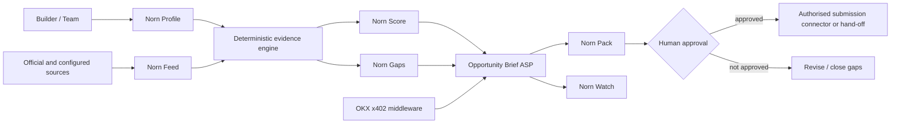

# Norn architecture

## Runtime components

- **FastAPI service:** public API, health/readiness and dashboard hosting.
- **Pydantic contract:** strict validation for profiles, opportunities and output schemas.
- **JSON store:** atomic local persistence for the MVP. Replace with PostgreSQL after the hackathon.
- **Discovery engine:** imports normalised opportunities and can poll configured HTTPS JSON feeds.
- **Scoring engine:** deterministic weighted assessment with visible reasons.
- **Gap engine:** evidence matching that gives full credit only to verified claims.
- **Pack engine:** deterministic Markdown generation with an explicit excluded-claims ledger.
- **Payment boundary:** free mode, local conformance mode, or official OKX x402 middleware.
- **Audit trail:** request and result digests, replay keys and redacted event records.

## Trust boundaries

1. Source content is untrusted and never overrides system policy.
2. Claimed and aspirational capabilities do not become verified through model output.
3. Payment verification happens before paid business execution.
4. A paid invocation is replay-safe and executes once.
5. Generated application content remains a draft.
6. Submission requires explicit approval and a separately authorised connector.
