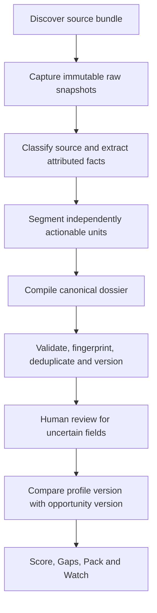

# Norn Opportunity Compiler — Normalization v2

Norn is an opportunity compiler, not an opportunity scraper. It converts fragmented source bundles into versioned, evidence-backed opportunity dossiers, then compares a specific dossier version with a specific Norn Profile version.

## Pipeline



## Source bundles

`NORN_SOURCE_BUNDLE_URLS` accepts comma-separated HTTPS sources. A bundle should include as many issuer-controlled surfaces as exist:

- primary announcement;
- programme, cycle and track pages;
- rules and eligibility;
- prizes or funding breakdown;
- FAQ;
- application form;
- technical documentation;
- associated repository or GitHub issue;
- update posts;
- issuer identity page.

Every HTTP response is stored as an immutable `source_snapshots` row before extraction. The snapshot records URL, retrieval time, content digest, content type, HTTP status, source quality and classified page type. Raw bytes are retained locally so future compiler versions can rerun normalization without rewriting history.

## Canonical dossier

The public `Opportunity` model remains API-compatible, but now represents a dossier with:

- canonical identity, version and fingerprint;
- programme, cycle, track and parent relationships;
- subtypes, themes, ecosystems and technical domains;
- attributed commercial value and timing;
- structured eligibility, requirements and deliverables;
- evaluation criteria and application workflow;
- multiple source snapshot IDs and field-level provenance;
- completeness, confidence, lifecycle and review state;
- changed fields from the previous version.

Legacy string requirements are converted to `OpportunityRequirement` objects at validation time. New compiler output writes structured requirements directly.

## Attribution states

Every important normalized field may be attributed as:

- `explicit` — directly stated by the source;
- `derived` — deterministically calculated from explicit facts;
- `inferred` — classified or estimated by Norn;
- `unknown` — not found;
- `conflicting` — sources disagree.

An inferred effort estimate, competition level or classification is never represented as an issuer-provided fact.

## Deterministic compiler passes

1. **Source classification** — programme, track, rules, FAQ, prizes, application, documentation, GitHub issue or unknown.
2. **Entity resolution** — canonical issuer spelling and programme identity.
3. **Opportunity segmentation** — broad records with a `tracks` array become independent actionable dossiers.
4. **Fact extraction** — structured input first; deterministic HTML/RSS pattern extraction second.
5. **Unit normalization** — dates, currencies, values and technical aliases are normalized while original values remain in field provenance.
6. **Validation** — Pydantic rejects malformed dossier values; production settings reject non-HTTPS discovery sources.
7. **Deduplication** — fingerprint uses issuer, programme, cycle, track, deadline and application URL rather than upstream ID alone.
8. **Versioning** — changed content appends an `opportunity_versions` row and records changed fields; unchanged content is idempotent.

AI extraction can be added behind this boundary later. Deterministic validators, not model confidence alone, decide whether a dossier becomes normalized or verified.

## Storage

SQLite is the local source of truth and can migrate cleanly to PostgreSQL. The schema includes:

- `sources`;
- `source_snapshots`;
- `programmes`;
- `opportunities`;
- `opportunity_versions`;
- `requirements`;
- `opportunity_sources`;
- `normalization_runs`;
- `profile_versions`;
- `assessments`;
- `review_queue`;
- `watch_events`.

Profile, Pack, Watch, audit and replay JSON files remain temporarily behind the `JsonStore` compatibility facade. Opportunity records are migrated from the seed JSON into SQLite on first start.

## Assessment truth boundary

Opportunity truth is stored independently of personal fit. Each assessment identifies:

```text
profileVersion + opportunityVersion + scoringEngineVersion
```

Hard eligibility is one of `met`, `failed` or `unknown`. Unknown mandatory eligibility does not receive quiet partial eligibility credit and prevents `pursue_now`.

## Feed intelligence

`POST /api/feed` now returns each dossier plus an `intelligence` object containing:

- why Norn found it;
- official-source and source-quality state;
- completeness and freshness;
- changed fields;
- deadline verification;
- independent actionability;
- eligibility and hard eligibility;
- evidenced requirement count;
- strongest verified match;
- critical gap;
- recommended next action;
- review state, lifecycle and dossier version.

Additional endpoints:

```text
GET  /api/opportunities/{canonical_id}/history
GET  /api/feed/review
POST /api/feed/review/{review_id}
```

## Human review

A review item is created when normalization confidence is below 0.75, completeness is below 0.60, requirements are missing, or the source is not official. Approval records a reviewer decision; it does not silently rewrite issuer facts.

## Current milestone and limits

Implemented:

- source snapshots and raw capture;
- structured requirements and field provenance;
- programme/cycle/track relationships;
- canonical fingerprinting and version history;
- official HTML, JSON/RSS and GitHub adapters;
- review queue;
- Feed freshness, completeness, quality and change signals;
- version-keyed assessments and paid-result provenance.

Still required before calling the corpus production-ready:

- curate and normalize at least 30 real technical opportunities;
- add source-specific adapters for high-value issuers where generic HTML extraction is insufficient;
- add conflict resolution across multiple official snapshots;
- build reviewer authentication and an editing interface;
- migrate remaining JSON artefacts into SQLite/PostgreSQL;
- evaluate extraction quality against a labelled dossier benchmark.
